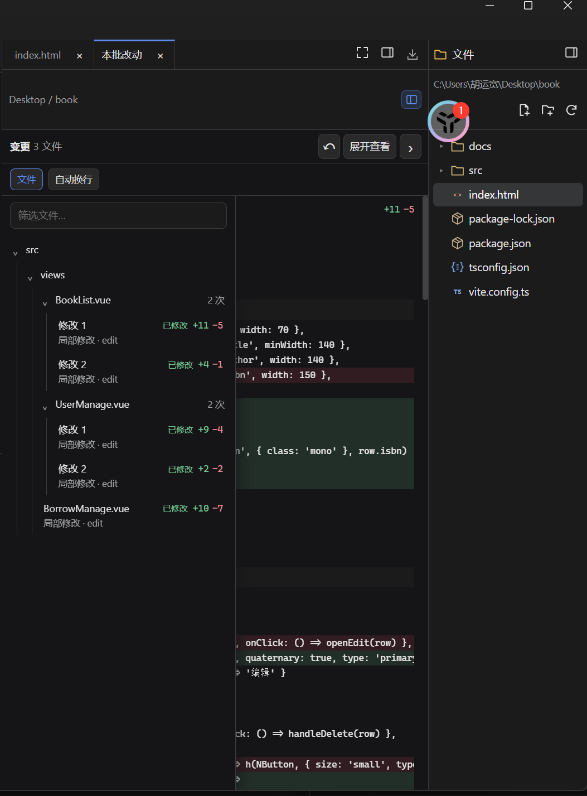

# 变更记录与 Diff 审阅：后续待办

记录日期：2026-10-07。用户要求先记录，后续单独优化；本文不是已确认的执行计划，不改变当前能力。

## 已确认待办

- **CHANGES-01：变更记录机制参考 DeepSeek Harness。** 后续评估按文件汇总同一批次/轮次的净变化、空变更入口、轮次历史及 Shell 变更捕获，不在当前 UI 阶段实施。
- **CHANGES-02：Diff 与变更列表 UI 参考 Harness。** 后续单独调整审阅顶栏、文件选择、增删统计、统一/左右对照、换行、空状态和内容空间预算；最右项目目录与审阅文件选择职责明确，减少重复导航占用正文。

## 当前事实与参考来源

当前 `ChangeReviewOwner` 仅在内存保留当前工具批次的实际修改快照，按执行记录展示；新批次替换、项目作用域变化清空。`preview.js` 连续展示修改，保留执行状态和工具撤销，不捕获一般 Shell 文件变化。可在没有修改时打开空审阅标签。

本地 Harness 的 `packages/deliverables/workspace-changes` 按顶层轮次开始/结束快照与文件工具捕获形成净变化；Git覆盖范围内可包含Shell改动，记录保留至Session释放，不代表重启后持久历史。`packages/client/ui-deliverables/src/client/ReviewTab.tsx` 通过文件选择菜单一次审阅一个文件，支持统一/左右对照；`ChangedFiles.tsx` 提供按轮次改动卡片入口。

用户当前布局截图已保存：

截图是当前项目的问题参考，不是 Harness 目标效果图。当前左侧变更导航包含多次修改记录，并较多占用Diff正文；后续与Harness实际界面对照，不直接将该截图固化为推荐样式。

## 后续规划时需决定

1. 先优化当前批次的按文件汇总与审阅UI，还是同时引入轮次记录；工具批次与官网AI轮次的关系需明确定义。
2. Shell变更捕获覆盖范围、是否依赖Git、捕获开销和安全边界。
3. 历史记录的生命周期与项目切换规则；不得把未来行为写成已实现。
4. 汇总净变化与现有逐次撤销的关系，避免UI合并后丢失真实执行状态或错误撤销。

## 后续验收方向

同文件多次修改、新增文件、修改后恢复原文、失败/拒绝、零变更、长路径、大文件、窄窗、统一/左右对照、项目切换及撤销均需有明确行为。UI验收采用真实Electron截图与可操作性检查；历史和Shell能力若纳入，另加语义测试。

未授权当前实施；开始优化前形成单独计划并确认未决范围。
